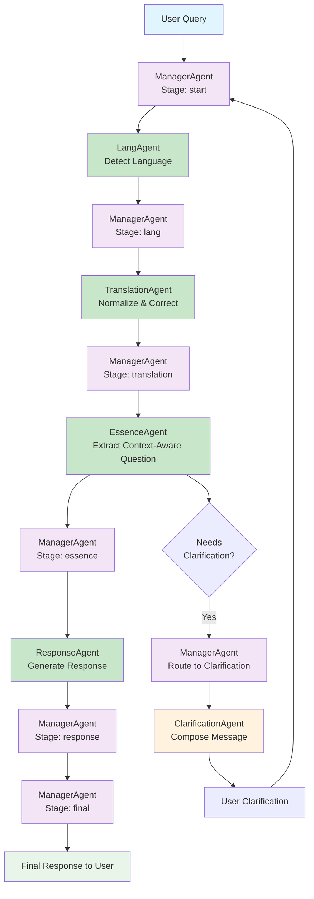

# RAG Assistant Pipeline Architecture

## Overview

This document defines the comprehensive agent architecture for the industry-agnostic RAG-based documentation assistant. The system uses a dynamic flow with intelligent routing decisions powered by LLM analysis rather than rigid pattern matching.

## Current Implementation Status (v2.3)

### ✅ **Implemented Agents**
- **ManagerAgent**: Dynamic pipeline orchestrator with intelligent routing
- **LangAgent**: Language detection using conversation history patterns  
- **TranslationAgent**: Mandatory translation and text normalization
- **EssenceAgent**: Context-aware canonical question extraction with temporal context
- **ResponseAgent**: LLM-powered response generation
- **ClarificationAgent**: Polite, localized clarification message composition

### 🚧 **Planned Agents** (Future RAG Enhancement)
- **GuardrailsAgent**: Documentation scope enforcement
- **SearchAgent**: Multi-level RAG search across documentation
- **AugmentationAgent**: Enhanced LLM prompt crafting with search context
- **QualityAgent**: Response validation with pipeline retry capability

### 🎯 **Recent Major Improvements**
1. **Enhanced Temporal Context** (v2.3):
   - Timestamped conversation history with format `[YYYY.MM.DD HH:MM:SS]`
   - Current time awareness for LLM temporal understanding
   - Conversation evolution tracking across clarifications

2. **Context-Aware Canonical Questions** (v2.3):
   - **RAG-ready questions** that include domain/topic context from conversation
   - **Self-contained queries** that work without conversation history
   - **Perspective preservation** - never flips user intent direction
   - **Critical for RAG success**: Transforms generic questions into searchable, contextual queries

3. **Universal Clarification System** (v2.2):
   - Any agent can request clarification when uncertain
   - Prevents hallucinations and pipeline failures
   - Consistent user experience across all uncertainty scenarios

## Core Principles

1. **Industry-Agnostic**: Based on universal data structure patterns, not domain-specific knowledge
2. **LLM-Powered Decisions**: Intelligent routing using AI analysis, not pattern matching
3. **Dynamic Flow**: Conversations can be interrupted, redirected, or returned to previous steps
4. **Security-First**: Guardrails enforce documentation-only responses
5. **Data-Driven**: Leverages all available metadata from RAG pipeline

## Data Structure Foundation

The architecture is built around the standardized document structure from the RAG pipeline:

```json
{
  "id": "doc-id-hash",
  "source": "https://domain.com/path",
  "crumbs": ["Category", "Subcategory", "Topic"],
  "description": "Brief description",
  "content": "Full content with image descriptions", 
  "summary": "LLM-generated summary",
  "keypoints": ["Point 1", "Point 2"],
  "keywords": ["term1", "term2"],
  "chunks": ["chunk1", "chunk2"]
}
```

## Core Architecture Principles

### Centralized Routing Authority
**Critical Design Rule**: Only the **ManagerAgent** has routing authority in the system.

- **All agents** (except ManagerAgent) process messages and return results via **default routing**
- **Only ManagerAgent** examines agent outputs and sets `target_role` for next pipeline step
- **No agent** directly routes messages to other agents or modifies `target_role`
- **ManagerAgent** acts as the central orchestrator, making all routing decisions based on agent analysis results

This ensures:
- **Predictable message flow** with single point of control
- **Simplified agent logic** focused on processing, not routing
- **Centralized pipeline state management** in ManagerAgent
- **Clear separation of concerns** between processing and orchestration

### Performance and Concurrency
**Critical Performance Rule**: LLM-backed agents must have multiple instances to prevent blocking.

**Instance Configuration**:
- **Single instances** (fast, non-LLM): ManagerAgent, LangAgent, CommandAgent
- **Multiple instances** (LLM-backed): All other agents (2+ instances each)

**Rationale**:
- LLM calls can have 1-10+ second latency
- Single LLM agent instances create pipeline bottlenecks
- Multiple instances enable concurrent processing
- Non-LLM agents (routing, language detection) are fast enough for single instances

### Unified Clarification System
**Critical Design Rule**: Any agent can request clarification when uncertain, preventing hallucinations and pipeline failures.

**Clarification Protocol**:
- **Any agent** can set `needs_clarification = true` when uncertain about user intent, scope, context, or quality
- **Requesting agent** should also set `clarification_reason` and basic `clarification_message`
- **ManagerAgent** detects clarification requests and routes to **ClarificationAgent**
- **ClarificationAgent** crafts polite, comprehensive, localized user responses for ALL refusal scenarios
- **No agent** should hallucinate or fail silently when facing any uncertainty

**Clarification as Universal Refusal**: Clarification is the polite, professional way to refuse answering regardless of reason (ambiguity, vagueness, out-of-scope, insufficient details, quality issues).

**Universal Clarification Attributes** (any agent can write):
- `needs_clarification` - Boolean indicating uncertainty requiring user input
- `clarification_reason` - Reason code: "ambiguous_query", "insufficient_context", "scope_unclear", "multiple_topics", "missing_details", "out_of_scope", "quality_insufficient"
- `clarification_message` - Agent-specific message explaining what clarification is needed

**Benefits**:
- **Prevents hallucinations**: Agents request clarification instead of guessing
- **Graceful degradation**: Pipeline doesn't break on ambiguous inputs
- **Consistent UX**: All clarification requests handled uniformly by ClarificationAgent
- **Localized communication**: Clarification messages automatically translated to user's language
- **Context-aware messaging**: Uses conversation history and agent context for better clarification
- **Improved accuracy**: Better user input leads to better responses

## Agent Definitions

### 1. ManagerAgent
**Role**: `manager`  
**Purpose**: Dynamic pipeline orchestrator with intelligent routing decisions  
**Instances**: 1 (lightweight routing logic)

**Responsibilities**:
- **Exclusive routing authority**: Only agent that sets `target_role` and controls message flow
- FSM-based pipeline orchestration based on other agents' outputs
- **Unified clarification handling**: Detects `needs_clarification` from any agent and crafts user responses
- Dynamic routing decisions based on LLM analysis results
- Conversation memory integration and user preference tracking
- Pipeline interruption and return handling

**Routing Architecture**:
- **All other agents** process messages and return results to ManagerAgent via default routing
- **Only ManagerAgent** examines results and determines next pipeline step
- **No agent** (except ManagerAgent) directly routes messages to other agents

**Envelope Attributes**:
- **Reads**:
  - `stage` - Current pipeline stage for routing decisions
  - `language` - Detected user language from LangAgent
  - `within_scope` - Boolean indicating if query is within documentation scope
  - `search_quality` - Search result quality: "excellent", "good", or "poor"
  - `needs_clarification` - Boolean indicating if ANY agent needs clarification (universal)
  - `clarification_reason` - Reason code from clarifying agent (universal)
  - `clarification_message` - Agent-specific clarification message (universal)
  - `clarification_result` - User's response to clarification: "search_again" or "exit"
  - `quality_decision` - Quality control decision: "approve", "clarify", "research", or "regenerate"
- **Writes**:
  - `stage` - Next pipeline stage to execute
  - `target_role` - Next agent role to process the message (**EXCLUSIVE**: only ManagerAgent sets this)
  - `response` - Final response message for user (when terminating pipeline)

**Key Routing Decisions**:
- Skip translation for English queries
- Route to clarification based on search quality
- Handle guardrails violations (reject/clarify/proceed)
- Quality control returns (approve/clarify/research/regenerate)

### 2. LangAgent
**Role**: `lang`  
**Purpose**: Language detection and normalization  
**Instances**: 1 (fast language detection)

**Responsibilities**:
- Detect user's primary language from query and history
- Calculate confidence scores for language detection
- Store language preferences in conversation memory
- Provide language context for downstream agents

**Envelope Attributes**:
- **Reads**:
  - `text` - Original user input query
  - Conversation history from distributed memory (recent messages for context)
- **Writes**:
  - `language` - Detected language code (en, ru, zh, es, fr, de, etc.)
  - `confidence` - Language detection confidence score (0.0-1.0)

**Supported Languages**: en, ru, zh, es, fr, de, and others based on conversation patterns

### 3. TranslationAgent
**Role**: `translation`  
**Purpose**: Mandatory translation and text normalization for all queries  
**Instances**: 2 (LLM translation services)

**Responsibilities**:
- **Always process all queries** regardless of detected language
- Translate non-English queries to English for optimal search performance
- **Spell-check and correct English queries** (typos, grammar, clarity)
- Handle technical terminology correctly
- Preserve original query for response language matching
- Maintain translation/correction confidence scores

**Envelope Attributes**:
- **Reads**:
  - `text` - Original user input in any language (may contain errors)
  - `language` - Source language code from LangAgent
- **Writes**:
  - `text_eng` - Clean, corrected English version for search optimization
  - `translation_confidence` - Translation/correction quality confidence score (0.0-1.0)
  - `corrections_made` - Boolean indicating if spelling/grammar corrections were applied

**Processing Logic**:
- **Non-English**: Translate to clean English
- **English**: Spell-check, grammar-check, and normalize text
- **Always produces**: Clean `text_eng` for downstream agents

### 4. EssenceAgent ✅ **IMPLEMENTED**
**Role**: `essence`  
**Purpose**: Extract canonical question from conversation history with temporal context  
**Instances**: 2 (LLM context extraction)

**Responsibilities**:
- **Extract context-aware canonical questions** that include domain/topic context for RAG compatibility
- **Resolve pronouns and references** ("it", "that feature", etc.) using conversation history
- **Combine related questions** from conversation history into self-contained queries
- **Preserve user's perspective** and intent direction (never flip question direction)
- **Create RAG-ready questions** that are understandable without conversation history
- **Detect follow-up questions** vs new topics with temporal awareness
- **Clean and normalize queries** for optimal search performance

**Enhanced Temporal Context Features**:
- **Timestamped conversation history**: Receives conversation history with timestamps in format `[YYYY.MM.DD HH:MM:SS]`
- **Current time awareness**: Gets current time context for temporal understanding
- **Conversation evolution tracking**: Can track how user intent changes over time
- **Context preservation**: Maintains conversation flow understanding across clarifications

**Envelope Attributes**:
- **Reads**:
  - `text` - Original user input
  - `text_eng` - Clean English version from TranslationAgent
  - Timestamped conversation history from distributed memory (with `show_timestamps=True`)
  - Current time context for temporal awareness
- **Writes**:
  - `canonical_question` - **Context-aware**, self-contained query ready for RAG search
  - `context_type` - Type of context: "new_topic", "follow_up", "clarification"
  - `related_history` - Relevant previous messages that provide context
  - **Universal clarification attributes** (when query too ambiguous):
    - `needs_clarification` - Set to `true` when user intent unclear
    - `clarification_reason` - Set to `"ambiguous_query"`, `"missing_context"`, `"vague_request"`, etc.
    - `clarification_message` - Basic message explaining what clarification is needed

**Critical RAG Enhancement**:
- **BEFORE**: "Why are two stages needed?" (generic, RAG search fails)
- **AFTER**: "Why are two stages needed in rocket launches and space missions?" (context-aware, RAG-ready)

**Example Context-Aware Transformations**:
- "What do you know about X?" → "What information is available about X?"
- "How does it work?" → "How does OAuth authentication work?" (using conversation context)
- "Why are two stages needed?" → "Why are two stages needed in rocket launches?" (domain context included)

### 5. GuardrailsAgent
**Role**: `guardrails`  
**Purpose**: LLM-powered documentation scope enforcement  
**Instances**: 1 (security checkpoint)

**Responsibilities**:
- Analyze query intent using LLM intelligence
- Determine if queries are within documentation scope
- **Use universal clarification system** for out-of-scope queries (no direct rejection)
- Prevent access to general knowledge outside documentation
- Provide analysis for ManagerAgent routing decisions

**Envelope Attributes**:
- **Reads**:
  - `canonical_question` - Cleaned and normalized user query from EssenceAgent
  - `domain_scope` - Documentation scope configuration (from environment/config)
- **Writes**:
  - `within_scope` - Boolean indicating if query is within documentation boundaries
  - `guardrails_confidence` - Confidence score (0.0-1.0) for the analysis
  - `guardrails_analysis` - Full LLM analysis including intent and reasoning
  - **Universal clarification attributes** (when out-of-scope):
    - `needs_clarification` - Set to `true` for out-of-scope queries
    - `clarification_reason` - Set to `"out_of_scope"` 
    - `clarification_message` - Basic message explaining scope limitations

**Scope Analysis**:
- `within_scope = true`: Query is within scope, continue to search
- `within_scope = false`: Query is out-of-scope, trigger clarification via ClarificationAgent

### 6. SearchAgent
**Role**: `search`  
**Purpose**: Multi-level search across documentation using all metadata fields  
**Instances**: 2 (concurrent search processing)

**Responsibilities**:
- **Level 1**: Keyword search using `keywords` field
- **Level 2**: Semantic search using `chunks` embeddings
- **Level 3**: Hierarchical search using `crumbs` navigation paths
- **Level 4**: Summary search using `summary` and `keypoints`
- Rank and merge results from all search levels
- Assess search quality and coverage

**Envelope Attributes**:
- **Reads**:
  - `canonical_question` - Cleaned and normalized user query from EssenceAgent
  - `text_eng` - Clean English version from TranslationAgent
- **Writes**:
  - `search_results` - Array of matching document chunks with metadata and scores
  - `search_context` - Formatted context string for LLM consumption
  - `search_stats` - Search statistics (total results, used results, context length, avg score)
  - `search_quality` - Quality assessment: "excellent", "good", or "poor"
  - `search_error` - Error message if search fails (optional)

**Search Quality Assessment**:
- `excellent`: High-confidence results with good coverage
- `good`: Adequate results, proceed to response
- `poor`: Low-quality results, trigger clarification

### 7. ClarificationAgent
**Role**: `clarification`  
**Purpose**: Compose polite, comprehensive, localized clarification messages  
**Instances**: 2 (LLM message composition)

**Responsibilities**:
- **Compose clarification messages**: Transform agent uncertainty into user-friendly requests
- **Context-aware messaging**: Use conversation history and requesting agent context
- **Localization**: Translate clarification messages to user's preferred language
- **Professional tone**: Maintain appropriate tone for the documentation domain
- **Actionable guidance**: Provide specific suggestions on how user can clarify their request

**Envelope Attributes**:
- **Reads**:
  - `needs_clarification` - Boolean from requesting agent indicating uncertainty
  - `clarification_reason` - Reason code from requesting agent
  - `clarification_message` - Basic message from requesting agent
  - `language` - User's preferred language for response localization
  - `stage` - Current pipeline stage to understand context
  - Conversation history from memory for context
- **Writes**:
  - `response` - Final localized clarification message to user
  - `clarification_type` - Type of clarification: "ambiguity", "scope", "context", "choice"
  - `suggested_actions` - Array of specific actions user can take

**Note**: ClarificationAgent does NOT detect ambiguities - it only composes responses when other agents request clarification.

### 8. AugmentationAgent
**Role**: `augmentation`  
**Purpose**: Craft enhanced LLM prompts with search context  
**Instances**: 1 (prompt engineering)

**Responsibilities**:
- Build enhanced prompts with documentation context
- Include source attribution from `source` URLs
- Add breadcrumb navigation context from `crumbs`
- Structure context for optimal LLM performance
- Ensure all necessary context is included

**Envelope Attributes**:
- **Reads**:
  - `search_results` - Array of relevant document chunks with metadata
  - `search_context` - Formatted context string from SearchAgent
  - `canonical_question` - Normalized user query
  - `language` - User's preferred response language
  - `text` - Original query in user's language
- **Writes**:
  - `augmented_prompt` - Enhanced LLM prompt with documentation context
  - `source_references` - Array of source URLs and breadcrumb paths
  - `context_structure` - Structured metadata about included context

### 9. ResponseAgent
**Role**: `response`  
**Purpose**: Generate final response using flagship LLM with constraints  
**Instances**: 2 (concurrent LLM processing)

**Responsibilities**:
- Generate responses using flagship LLM (GPT-4, Gemini, etc.)
- **Detect uncertainty** when documentation context is insufficient for user's specific question
- Enforce strict documentation-only constraints
- Match user's preferred language
- Include source references and navigation hints
- Format responses appropriately for the domain

**Envelope Attributes**:
- **Reads**:
  - `augmented_prompt` - Enhanced prompt with documentation context from AugmentationAgent
  - `language` - Target language for response generation
  - `canonical_question` - User's normalized query for context
  - Conversation history from distributed memory (for conversational context)
- **Writes**:
  - `response` - Generated response text in user's preferred language
  - `sources_used` - Array of documentation sources referenced in response
  - `generation_confidence` - LLM confidence score for the generated response (0.0-1.0)
  - `generation_error` - Error message if LLM generation fails (optional)
  - **Universal clarification attributes** (when documentation insufficient):
    - `needs_clarification` - Set to `true` when documentation doesn't contain sufficient info for user's question
    - `clarification_reason` - Set to `"insufficient_context"` or `"missing_details"`
    - `clarification_message` - Basic message explaining what specific information is missing from documentation

**Constraints**:
- Only use provided documentation context
- No general knowledge beyond documentation
- Include source attribution
- Maintain professional tone appropriate for domain

### 10. QualityAgent
**Role**: `quality`  
**Purpose**: Final response validation with return capability  
**Instances**: 1 (quality control)

**Responsibilities**:
- Validate response accuracy against source documents
- Check for information outside documentation scope
- Detect potential hallucinations or knowledge leakage
- **Make three-way routing decisions**: approve, pipeline retry, or clarification
- Ensure response completeness and clarity

**Envelope Attributes**:
- **Reads**:
  - `response` - Generated response from ResponseAgent
  - `search_context` - Original documentation context used for generation
  - `canonical_question` - User's normalized query for validation
  - `source_references` - Sources that should be reflected in the response
- **Writes**:
  - `quality_score` - Overall quality score combining accuracy and completeness (0.0-1.0)
  - `quality_decision` - Routing decision: "approve", "research", or "regenerate"
  - `quality_analysis` - Detailed LLM analysis of response quality and issues
  - `validation_result` - Structured validation results including accuracy and scope compliance
  - **Universal clarification attributes** (when user details insufficient):
    - `needs_clarification` - Set to `true` when response fails due to insufficient user details
    - `clarification_reason` - Set to `"quality_insufficient"`
    - `clarification_message` - Basic message explaining what additional details are needed

**Quality Routing**:
- `approve`: Response is good, send to user
- `research`: Response inaccurate due to pipeline issues, search again (ManagerAgent handles)
- `regenerate`: Response has generation issues, regenerate (ManagerAgent handles)
- **Clarification**: Response inadequate due to insufficient user details, trigger clarification via ClarificationAgent

## Envelope Attribute Summary

This table provides a complete overview of which **payload attributes** each agent reads and writes within `envelope.payload`, ensuring clear data contracts and preventing conflicts.

**Important Notes**:
- **All listed attributes are within `envelope.payload` dictionary**
- **Only ManagerAgent** writes `target_role` (envelope system attribute)
- **All other agents** use default routing to return results to ManagerAgent
- **Any agent** can write universal clarification attributes when uncertain
- **Agents NEVER modify** envelope system attributes directly

**Universal Clarification Attributes** (any agent can write):
- `needs_clarification` - Boolean indicating uncertainty requiring user input
- `clarification_reason` - Reason code for clarification request
- `clarification_message` - Agent-specific message explaining what's needed

| Agent | Status | Reads | Writes |
|-------|--------|-------|--------|
| **ManagerAgent** | ✅ **Implemented** | `stage`, `language`, `needs_clarification`, `clarification_reason`, `clarification_message`, `response` | `stage`, `response` (for final/rejection messages) + **`target_role`** (system attribute) |
| **LangAgent** | ✅ **Implemented** | `text` (user query), conversation history from memory | `language`, `confidence` |
| **TranslationAgent** | ✅ **Implemented** | `text`, `language` | `text_eng`, `translation_confidence`, `corrections_made` |
| **EssenceAgent** | ✅ **Implemented** | `text`, `text_eng`, timestamped conversation history from memory, current time context | `canonical_question` (context-aware), `context_type`, `related_history` + **universal clarification attributes** (when ambiguous) |
| **ResponseAgent** | ✅ **Implemented** | `canonical_question`, `language`, conversation history from memory | `response`, `generation_confidence`, `generation_error` (if any) + **universal clarification attributes** (when insufficient context) |
| **ClarificationAgent** | ✅ **Implemented** | `needs_clarification`, `clarification_reason`, `clarification_message`, `language`, `stage`, conversation history from memory | `response`, `clarification_type`, `suggested_actions` |
| **GuardrailsAgent** | 🚧 **Planned** | `canonical_question`, `domain_scope` (from config) | `within_scope`, `guardrails_confidence`, `guardrails_analysis` + **universal clarification attributes** (when out-of-scope) |
| **SearchAgent** | 🚧 **Planned** | `canonical_question`, `text_eng` | `search_results`, `search_context`, `search_stats`, `search_quality`, `search_error` (if any) |
| **AugmentationAgent** | 🚧 **Planned** | `search_results`, `search_context`, `canonical_question`, `language`, `text` | `augmented_prompt`, `source_references`, `context_structure` |
| **QualityAgent** | 🚧 **Planned** | `response`, `search_context`, `canonical_question`, `source_references` | `quality_score`, `quality_decision`, `quality_analysis`, `validation_result` + **universal clarification attributes** (when insufficient user details) |

### Envelope Structure and Attribute Separation

**CRITICAL ARCHITECTURAL RULE**: Agents operate on `envelope.payload` dictionary, NOT on envelope system attributes.

#### System-Level Envelope Attributes
**Managed by BaseAgent framework - NEVER modify directly in agent code**:
- `conversation_id` - Unique conversation identifier
- `message_id` - Unique message identifier  
- `create_ts` - Message creation timestamp
- `update_ts` - Last modification timestamp
- `process_count` - Safety circuit breaker counter
- `total_processing_time` - Cumulative processing time
- `sender_role` - Previous agent that sent message

#### Routing Control Attributes
**System-managed with controlled agent access**:
- `target_role` - Next agent role to process message (**ONLY ManagerAgent sets this**)
- `target_list` - Result list for pipeline completion (system-managed)
- `result_list` - Final result destination (system-managed)

#### Application-Level Payload Attributes
**Managed by agents via `envelope.payload` dictionary**:
- `text` - Original user input
- `stage` - Current pipeline stage
- `language` - Detected/preferred language
- `response` - Final response to user
- All other agent-specific attributes (search_results, canonical_question, etc.)

#### Agent Implementation Rule
```python
# ✅ CORRECT: Agents work with payload
env.payload['canonical_question'] = processed_query
env.payload['search_results'] = results

# ❌ WRONG: Never modify system attributes directly
env.conversation_id = "new_id"  # FORBIDDEN
env.process_count = 0           # FORBIDDEN
env.target_role = "other"       # FORBIDDEN (except ManagerAgent)
```

### Data Flow Patterns

**Language Processing Chain:**
```
text → language, confidence → text_eng → canonical_question
```

**Search and Context Chain:**
```
canonical_question → search_results, search_context → augmented_prompt → response
```

**Quality and Routing Chain:**
```
guardrails_routing → search_quality → needs_clarification → quality_decision
```

## Pipeline Flow Diagram

### Current Implementation (v2.3)
**✅ Currently Implemented Pipeline** (manager → lang → translation → essence → response):



### Future Complete Pipeline (Planned)
**🚧 Future RAG-Enhanced Pipeline** (with search, guardrails, quality control):


### Pipeline Decision Points

**🔄 Universal Clarification Triggers:**
- **EssenceAgent**: Query too short, ambiguous, or lacks context ✅ **Implemented**
- **ResponseAgent**: Insufficient context for accurate response ✅ **Implemented**
- **ClarificationAgent**: Composes user-friendly clarification messages ✅ **Implemented**
- **GuardrailsAgent**: Out of documentation scope 🚧 **Planned**
- **SearchAgent**: Poor search results quality 🚧 **Planned**
- **QualityAgent**: Poor response due to insufficient user details 🚧 **Planned**

**🎯 ManagerAgent Routing Logic:**
- Detects `needs_clarification = true` from any agent ✅ **Implemented**
- Routes to ClarificationAgent for user-friendly message composition ✅ **Implemented**
- Handles pipeline retries for quality issues 🚧 **Planned**
- Orchestrates entire conversation flow ✅ **Implemented**

## Key Achievements (v2.3)

### 🎯 **Context-Aware RAG Compatibility**
**Problem Solved**: Generic canonical questions break RAG search
- **Before**: "Why are two stages needed?" → RAG search fails (no context)
- **After**: "Why are two stages needed in rocket launches and space missions?" → RAG finds relevant documents

**Impact**: This breakthrough ensures RAG components can find relevant documents without needing full conversation history, making the system truly scalable and effective.

### ⏰ **Enhanced Temporal Context**
**Innovation**: First agentic system with comprehensive temporal awareness
- **Timestamped conversation history**: `[2025.09.28 21:52:32] User message content`
- **Current time context**: LLM knows current time vs message timestamps
- **Conversation evolution tracking**: Understands how intent changes over time

**Benefits**: Better context resolution, improved clarification decisions, temporal pattern recognition.

### 🔄 **Universal Clarification System**
**Design Excellence**: Any agent can request clarification when uncertain
- **Prevents hallucinations**: Agents ask for clarification instead of guessing
- **Consistent UX**: All uncertainty handled uniformly by ClarificationAgent
- **Graceful degradation**: Pipeline never breaks on ambiguous inputs

### 🎛️ **Centralized Routing Authority**
**Architectural Principle**: Only ManagerAgent controls message flow
- **Simplified agent logic**: Agents focus on processing, not routing
- **Predictable flow**: Single point of control for all routing decisions
- **Clean separation**: Processing vs orchestration concerns separated

### Attribute Naming Conventions

- **Input Attributes**: `text`, `canonical_question`, `text_eng`
- **Analysis Results**: `language`, `confidence`, `search_quality`, `quality_score`
- **Routing Decisions**: `within_scope`, `needs_clarification`, `quality_decision`
- **Generated Content**: `response`, `augmented_prompt`, `clarification_type`
- **Metadata**: `source_references`, `search_stats`, `context_structure`
- **Error Handling**: `search_error`, `generation_error`

